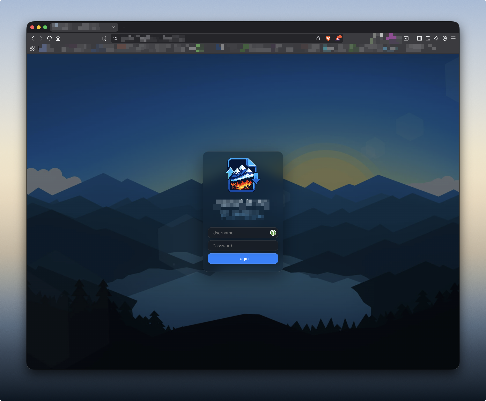
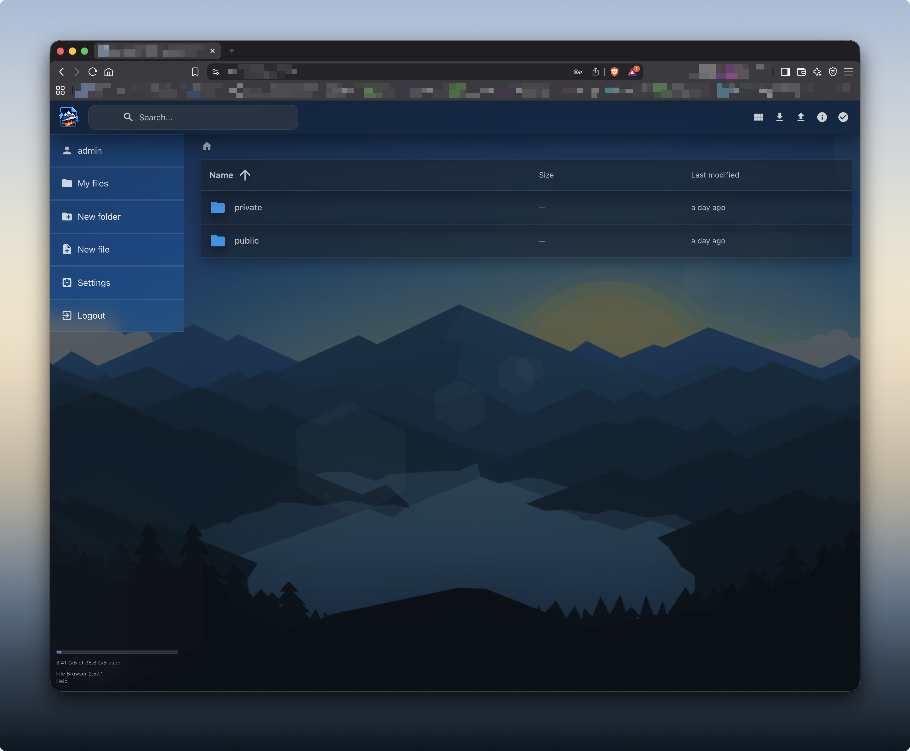

# Filebrowser iOS 26 Theme
Custom theme for [Filebrowser](https://github.com/filebrowser/filebrowser)
> This is a visual theme only. Filebrowser is required.

## Summary

This theme makes Filebrowser look like a modern iOS 26 styled app.

It adds glass effects, blur styling, and a custom background image.

------------------------------------------------------------------------
## Screenshots

### Desktop




### iPhone


------------------------------------------------------------------------
## Install

### 1. Download the CSS

Download:

`custom_iOS26-theme.css`

Place it in:

`filebrowser/branding/`

------------------------------------------------------------------------

### 2. Backup existing CSS

``` bash
cd filebrowser/branding
cp custom.css custom-backup.css
```

------------------------------------------------------------------------

### 3. Apply the theme

``` bash
cp custom_iOS26-theme.css custom.css
systemctl restart filebrowser
```

Clear your browser cache after restart.

------------------------------------------------------------------------

## Background Image

A default background image is included:

`filebrowser/branding/img/background.webp`

To use your own image:

1.  Put your image in\
    `filebrowser/branding/img/`

2.  Update the image path inside `custom.css` if needed.

------------------------------------------------------------------------

## Rollback

To restore the original CSS:

``` bash
cp custom-backup.css custom.css
systemctl restart filebrowser
```

------------------------------------------------------------------------

## Contribute

Feedback and improvements are welcome.

------------------------------------------------------------------------

## License

Use freely and modify as needed.
